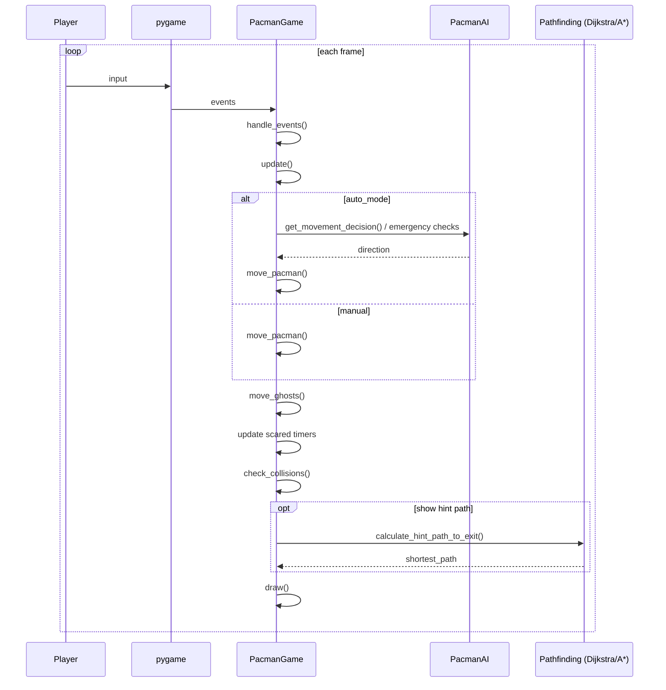

# Pacman Game – Tài liệu kiến trúc & cơ chế hoạt động

Tài liệu này mô tả chi tiết cách game Pacman trong repo hoạt động: vòng lặp game, cơ chế di chuyển/va chạm, chế độ Auto (AI), pathfinding, và cách các module phối hợp.

> Phạm vi: tập trung vào gameplay runtime (không đi sâu thuật toán nội bộ của Dijkstra/A* ngoài những điểm liên quan tới integration).

---

## 1) Tổng quan nhanh

Game được xây theo mô hình “game loop” kinh điển:

1. **Handle events**: đọc input từ người chơi (phím bấm, toggle UI, pause, restart…).
2. **Update**: cập nhật trạng thái (di chuyển Pacman/ghost, update timers, check collision, update hint path theo chu kỳ…).
3. **Draw**: vẽ toàn bộ khung hình (maze, dots/pellets, bombs, ghosts, UI, overlay visualizer).

Điểm đáng chú ý:
- **Di chuyển độc lập FPS** nhờ `delta_time`.
- Có hai chế độ điều khiển: **Manual** (người chơi) và **Auto** (AI chọn hướng).
- **Coordinate system kép**: lưới (grid) cho logic/pathfinding và pixel cho render/collision theo khoảng cách.

File chính:
- Runtime game: [pacman_game.py](../pacman_game.py)
- AI né ma / ra quyết định: [pacman_ai.py](../pacman_ai.py)
- Sinh mê cung: [maze_generator.py](../maze_generator.py)
- Pathfinding: [dijkstra_algorithm.py](../dijkstra_algorithm.py), [public/astar_algorithm.py](../public/astar_algorithm.py)
- Overlay phân tích: [ghost_avoidance_visualizer.py](../ghost_avoidance_visualizer.py)
- Tham số: [config.py](../config.py)

---

## 2) Architecture (module-level)

```mermaid
flowchart LR
  subgraph Game
    PG[PacmanGame]
  end

  subgraph Content
    MG[MazeGenerator]
    CFG[config]
  end

  subgraph Pathfinding
    DJ[DijkstraAlgorithm]
    AS[AStarAlgorithm]
  end

  subgraph AI
    AI1[PacmanAI]
  end

  subgraph UX
    VIZ[GhostAvoidanceVisualizer]
    PYG[pygame]
  end

  PG -->|generate_maze| MG
  PG -->|read constants| CFG

  PG -->|shortest_path & variants| DJ
  PG -->|shortest_path (fast hint)| AS

  PG -->|movement decision| AI1
  AI1 -->|reads game state| PG

  PG -->|render overlay & logs| VIZ
  PG -->|window/input/audio/render| PYG
```

Tóm lại:
- `PacmanGame` là “orchestrator”: giữ state, gọi AI, gọi pathfinding, xử lý va chạm, vẽ.
- `PacmanAI` không tự di chuyển trực tiếp; AI **chỉ quyết định hướng** (`pacman_next_direction`) và game vẫn dùng chung luật `move_pacman()` để thực thi.

---

## 3) Runtime loop (frame-level)

### 3.1 Vòng lặp chính
- `PacmanGame.run()` lặp `while self.running`:
  - `handle_events()` → `update()` → `draw()` → `clock.tick(target_fps)`.

Tham khảo: [pacman_game.py](../pacman_game.py#L4711-L4740)



### 3.2 Cơ chế `delta_time` (độc lập FPS)
- `update()` tính `raw_delta_time` theo ms thực tế giữa 2 frame.
- `delta_time` bị **cap** bởi `MAX_DELTA_TIME` để tránh nhảy xa khi lag.

Tham khảo: [pacman_game.py](../pacman_game.py#L4562-L4576)

---

## 4) Hệ tọa độ: Grid vs Pixel

### 4.1 Grid (logic)
- Maze là ma trận theo ô: `maze[row, col]`.
- Pacman/ghost lưu `pos` dưới dạng float `[col, row]`.
- Khi logic cần ô hiện tại: thường dùng `int(round(pos[0]))`, `int(round(pos[1]))`.

### 4.2 Pixel (render/collision)
- Center pixel của một ô:
  - `center_x = (col + 0.5) * cell_size`
  - `center_y = (row + 0.5) * cell_size`
- Dots/pellets/bombs thường lưu dạng pixel center để render và đo khoảng cách bằng `math.hypot`.

Tác động:
- **Render** đẹp và dễ.
- **Collision** dùng khoảng cách pixel nên “ăn hạt” mượt hơn thay vì phải đúng tâm ô.

---

## 5) Khởi tạo game (startup)

### 5.1 Khởi tạo core
Trong `PacmanGame.__init__()`:
- init pygame + mixer + audio
- tạo maze generator + pathfinding (Dijkstra/A*)
- load ghost images
- set state: score/lives/level
- tạo level (maze) → đặt Pacman vào start → tính exit gate
- rải dots/pellets
- load bombs
- create ghosts
- tạo `PacmanAI` và `GhostAvoidanceVisualizer`

Tham khảo: [pacman_game.py](../pacman_game.py#L12-L239)

### 5.2 Sinh mê cung
- `generate_level()` gọi `maze_gen.generate_maze()` nhiều lần (retry) đến khi layout hợp lệ.

Tham khảo: [pacman_game.py](../pacman_game.py#L237-L266)

### 5.3 Đặt exit gate
- `calculate_exit_gate_position()` lấy góc đối diện start, tìm ô đi được gần nhất.

Tham khảo: [pacman_game.py](../pacman_game.py#L297-L324)

---

## 6) Input & điều khiển

### 6.1 Manual movement
- Người chơi nhấn phím mũi tên → set `pacman_next_direction`.
- `move_pacman()` sẽ “đổi hướng” khi ô kế hợp lệ.

Tham khảo:
- Input: [pacman_game.py](../pacman_game.py#L4313-L4392)
- Movement: [pacman_game.py](../pacman_game.py#L1585-L1704)

### 6.2 Hotkeys
- `A`: toggle Auto
- `H`: bật/tắt hint path (đường gợi ý tới exit)
- `V/B/Shift+S`: visualizer
- `X`: toggle bombs
- `G`: toggle ghosts
- `P`: pause
- `R`: restart

Tham khảo: [pacman_game.py](../pacman_game.py#L4313-L4392)

---

## 7) Movement system

### 7.1 `move_pacman()` – thực thi di chuyển (rule engine)
Ý tưởng chính:
- Kiểm tra vị trí hiện tại hợp lệ; sai → reset về start.
- Nếu có `pacman_next_direction` thì thử rẽ (chỉ rẽ nếu ô mục tiêu hợp lệ).
- Nếu có `pacman_direction` thì tiến tới ô mục tiêu theo step `speed * delta_time`.
- Có tunnel wrap trái/phải.

Tham khảo: [pacman_game.py](../pacman_game.py#L1585-L1704)

### 7.2 `is_valid_position_ignore_eyes()` – luật đi qua ghost
- Ô phải là đường đi.
- Nếu có ghost ở đó:
  - Nếu ghost đã bị ăn (`eaten=True`) → **cho đi xuyên**.
  - Nếu ghost đang sợ và còn nhiều timer → **cho đi xuyên**.
  - Ngược lại → coi như chặn.

Tham khảo: [pacman_game.py](../pacman_game.py#L3886-L3938)

### 7.3 `move_ghosts()` – di chuyển ma
- Chỉ chạy khi `ghosts_enabled`.
- Nếu ghost “chỉ còn mắt” (eaten) → dùng `move_eaten_ghost_to_spawn()`.
- Nếu ghost bị lỗi vị trí → reset về vị trí an toàn.
- Có hệ thống chống kẹt (stuck detection) và các mode random/chase/scatter (tùy cấu hình/logic nội bộ).

Điểm vào chính: [pacman_game.py](../pacman_game.py#L1678)

---

## 8) Auto mode (AI) – cơ chế ra quyết định

### 8.1 Nguyên tắc integration
- Auto mode **không bypass** luật di chuyển.
- Flow:
  1. `move_pacman_auto()` chọn hướng
  2. `move_pacman()` thực thi

Tham khảo: [pacman_game.py](../pacman_game.py#L4594-L4606)

### 8.2 AI state machine (trực quan)
Trong `PacmanAI`, hệ state phổ biến:
- `NORMAL`: bình thường, đi theo goal.
- `ALERT`: có ma trong zone, cảnh giác.
- `EVADING/FLEEING`: né/thoát hiểm.
- `SAFE_RETURN`: vừa né xong, quay lại nhưng vẫn cảnh giác.

Tham khảo: [pacman_ai.py](../pacman_ai.py#L7-L23)

### 8.3 Các hàm AI “xương sống”
- **Cập nhật nhận thức ma (zone awareness)**: [pacman_ai.py](../pacman_ai.py#L188)
- **Quyết định hướng (state machine output)**: [pacman_ai.py](../pacman_ai.py#L444)
- **Né khẩn cấp**: [pacman_ai.py](../pacman_ai.py#L851)
- **Check ma gần**: [pacman_ai.py](../pacman_ai.py#L2211)
- **Dự đoán va chạm tương lai**: [pacman_ai.py](../pacman_ai.py#L2299)
- **Kiểm tra ma nằm trên đường tới goal**: [pacman_ai.py](../pacman_ai.py#L1789)

### 8.4 `move_pacman_auto()` – orchestration logic
- Ưu tiên xử lý “ma gần / imminent collision” trước.
- Nếu AI trả về quyết định `CRITICAL/HIGH/MEDIUM` → set `pacman_next_direction`.
- Nếu không có tình huống nguy hiểm → chọn goal (thường là `exit_gate`) và đi theo hint path.

Tham khảo: [pacman_game.py](../pacman_game.py#L2799-L3560)

---

## 9) Pathfinding & Hint path

### 9.1 Hint path (phím H)
- Khi bật `show_shortest_path`, game định kỳ (mỗi ~1000ms) tính lại hint path tới exit.
- Hint path vẽ bằng các chấm xanh lục.

Tham khảo:
- Tính hint: [pacman_game.py](../pacman_game.py#L2585-L2610)
- Vẽ hint: [pacman_game.py](../pacman_game.py#L2620-L2640)
- Update định kỳ: [pacman_game.py](../pacman_game.py#L4624-L4634)

### 9.2 Ưu tiên A* cho hint
- `calculate_shortest_path_to_goal()` ưu tiên `AStarAlgorithm.shortest_path()` trước, fallback Dijkstra nếu A* lỗi.

Tham khảo: [pacman_game.py](../pacman_game.py#L2537-L2583)

---

## 10) Collision system (ăn hạt, bom, ma, thắng/thua)

### 10.1 Dots & Power Pellets
- Dots: +10.
- Pellet: +50, bật `power_mode_end_time`, set ghost `scared=True` và `scared_timer`.

Tham khảo: [pacman_game.py](../pacman_game.py#L3941-L4096)

### 10.2 Bombs
- Nếu bombs bật (`bombs_enabled`) và Pacman vào bán kính nổ → mất mạng.

Tham khảo: [pacman_game.py](../pacman_game.py#L4097-L4140)

### 10.3 Ghost collision
- Nếu ghost sợ → Pacman ăn ghost (+200), ghost thành `eaten=True` (chỉ còn mắt), reset tránh ma để đi tiếp.
- Nếu ghost thường → Pacman mất mạng.

Tham khảo: [pacman_game.py](../pacman_game.py#L4141-L4288)

### 10.4 Win/Level progression
- Chạm exit gate → `level_complete`, +1000.
- Nếu hết dots & pellets → tăng level, generate lại.

Tham khảo: [pacman_game.py](../pacman_game.py#L4290-L4311)

---

## 11) Rendering pipeline

`draw()` vẽ theo thứ tự:
1. background
2. maze
3. dots/pellets
4. bombs
5. exit gate
6. shortest path (hint)
7. ghost return paths
8. pacman
9. ghosts
10. UI
11. visualizer overlay
12. game_over / level_complete overlay

Tham khảo: [pacman_game.py](../pacman_game.py#L4662-L4732)

---

## 12) Function Index (điểm nhảy nhanh)

### 12.1 PacmanGame (core)
- Startup: [pacman_game.py](../pacman_game.py#L14)
- Loop: [pacman_game.py](../pacman_game.py#L4711-L4740)
- Events: [pacman_game.py](../pacman_game.py#L4313-L4392)
- Update: [pacman_game.py](../pacman_game.py#L4562-L4635)
- Draw: [pacman_game.py](../pacman_game.py#L4662-L4732)

### 12.2 Map/content
- Generate level: [pacman_game.py](../pacman_game.py#L237-L266)
- Exit gate: [pacman_game.py](../pacman_game.py#L297-L324)
- Dots/pellets: [pacman_game.py](../pacman_game.py#L326-L360)
- Bombs load: [pacman_game.py](../pacman_game.py#L386-L430)

### 12.3 Movement & collision
- Pacman move: [pacman_game.py](../pacman_game.py#L1585-L1704)
- Ghost move: [pacman_game.py](../pacman_game.py#L1678)
- Collision: [pacman_game.py](../pacman_game.py#L3941-L4311)

### 12.4 Auto / AI integration
- Toggle Auto: [pacman_game.py](../pacman_game.py#L4695-L4710)
- Auto orchestration: [pacman_game.py](../pacman_game.py#L2799-L3560)

### 12.5 AI (PacmanAI)
- Zone awareness: [pacman_ai.py](../pacman_ai.py#L188)
- Movement decision: [pacman_ai.py](../pacman_ai.py#L444)
- Emergency avoidance: [pacman_ai.py](../pacman_ai.py#L851)
- Nearby ghosts: [pacman_ai.py](../pacman_ai.py#L2211)
- Imminent collision: [pacman_ai.py](../pacman_ai.py#L2299)

---

## 13) Gợi ý khi thuyết trình/đọc code

Nếu bạn cần “đọc code theo đúng luồng chạy”, cứ theo thứ tự:
1) `run()` → 2) `handle_events()` → 3) `update()` → 4) `move_*()` → 5) `check_collisions()` → 6) `draw()`.

---

## 14) TODO mở rộng (tuỳ chọn)

- Tách `move_pacman_auto()` thành các sub-step nhỏ hơn để dễ test.
- Thêm unit tests cho `is_valid_position_ignore_eyes()` và `get_bomb_grid_positions()`.

